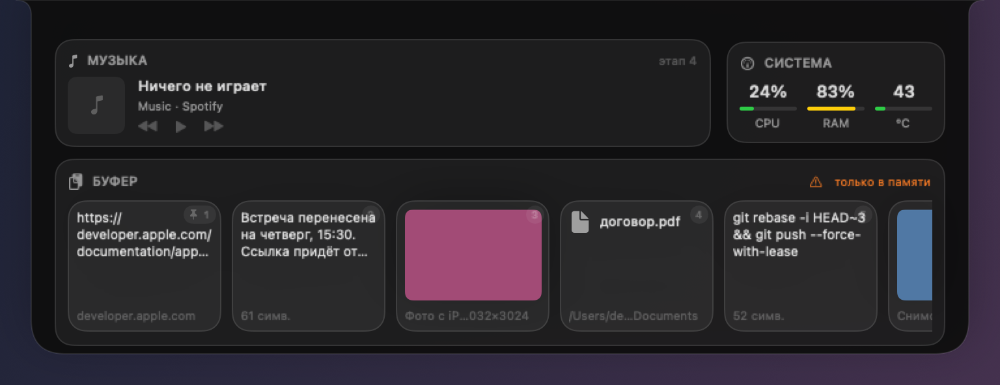
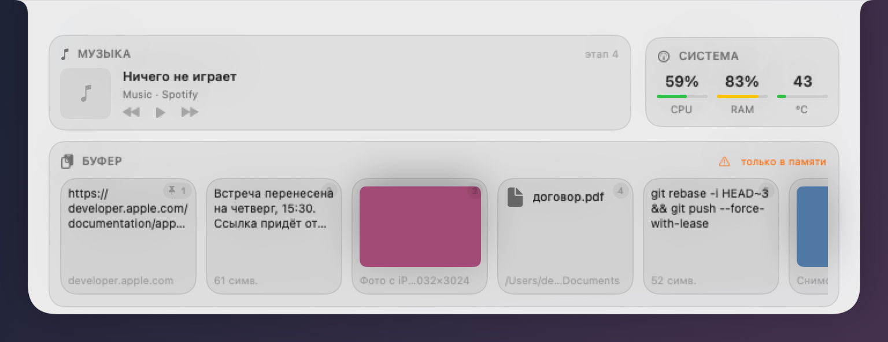

# Chelka

Виджет для выреза MacBook в духе Dynamic Island: буфер обмена с историей, музыка и состояние системы — по наведению курсора, без единого клика.



> **Статус: в разработке.** Готовы этапы 1–3 из 5 — окно виджета, буфер обмена, мониторинг. Музыка на подходе, см. [дорожную карту](#дорожная-карта).

## Возможности

- [x] Раскрытие по наведению на вырез, сворачивание при уходе курсора
- [x] Светлая, тёмная и авто-тема
- [x] Работа на дисплеях без выреза — компактный кругляш сверху
- [x] Корректное поведение при подключении мониторов и смене разрешения
- [x] **Буфер обмена**: 10 записей + 5 закреплённых, текст, ссылки, картинки, файлы
- [x] Скриншоты из папки снимков и фото с iPhone через Universal Clipboard
- [x] Перетаскивание записей мышью прямо из виджета в любое приложение
- [x] История шифруется на диске, ключ в связке ключей
- [x] Чёрный список приложений и глобальное сочетание ⌥⌘V
- [x] Мониторинг: загрузка CPU, память, температура кристалла
- [ ] Управление музыкой: Music.app, Spotify и глобальные медиа-клавиши

## Требования

- macOS 14 или новее
- Apple Silicon или Intel
- Swift 6 (Command Line Tools или Xcode)

Вырез не обязателен: на обычных дисплеях виджет живёт кругляшом по центру верхней кромки.

## Сборка

```bash
git clone <репозиторий> && cd chelka
make app
open build/Chelka.app
```

Приложение подписывается ad-hoc и работает локально. После запуска ищите иконку в меню-баре — иконки в доке нет намеренно.

## Команды

| Команда | Что делает |
|---|---|
| `make app` | Сборка `Chelka.app` в release с подписью |
| `make run` | Пересобрать и перезапустить |
| `make test` | Тесты ядра |
| `make check` | Полная проверка перед коммитом |
| `make diagnose` | Показать, что приложение видит на этой машине |
| `make snapshots` | Отрендерить виды в PNG без запуска UI |
| `make hover-demo` | Прогнать сценарий наведения и сверить состояния |
| `make clipboard-demo` | Сквозная проверка буфера на живой системе |
| `make metrics-demo` | Проверка метрик на живой машине |
| `make verify` | Все проверки разом |

## Архитектура

```
Sources/
├── ChelkaCore/     Ядро без AppKit: геометрия, состояния, логирование.
│                   Строгая конкурентность Swift 6, покрыто тестами.
└── Chelka/         UI-слой: панель, курсор, SwiftUI-виды, меню-бар.
```

Ключевые решения:

**Геометрия выреза берётся у системы.** Размеры считаются из `safeAreaInsets` и `auxiliaryTopLeftArea`, без таблиц моделей MacBook. На одной машине вырез 209×38 pt, на другой 168×32 — код одинаковый.

**Логика решений отделена от AppKit.** Когда раскрыться, когда свернуться, как пересчитать раскладку — всё это чистые функции в `ChelkaCore`, проверяемые тестами за миллисекунды. UI-слой только доставляет события и применяет результат.

**Время монотонное, а не календарное.** Задержки наведения считаются по `ProcessInfo.systemUptime`: `Date` прыгает при синхронизации часов и подвесил бы виджет раскрытым.

**Панель не крадёт клики.** Окно заведомо больше виджета — иначе анимации некуда расти. Прозрачные поля пропускают события сквозь себя, поэтому попасть в меню-бар мимо виджета невозможно.

**Снимки видов без экрана.** `make snapshots` рендерит все состояния в PNG офлайн — внешний вид проверяется в CI и в ревью, а не «у меня на макбуке выглядит нормально».

**Буфер проверяется на живой системе.** `make clipboard-demo` кладёт в буфер настоящие данные и сверяет двенадцать утверждений: дедупликация, лимиты, закрепление, чёрный список, отсутствие самозацикливания при собственной записи и то, что история реально дошла до диска. Буфер пользователя в конце восстанавливается.

**Наведение проверяется сценарием.** `make hover-demo` водит виджет по семи положениям курсора и сверяет состояния: быстрый пролёт не раскрывает, зависание раскрывает, спуск в тело виджета не сворачивает. Позиция курсора приходит через подменяемый источник — синтезировать события мыши без разрешения «Универсальный доступ» нельзя.

## Буфер обмена

Захватывается всё, что копируется: текст, ссылки, картинки, файлы из Finder. Снимки экрана подхватываются из папки, указанной в настройках macOS, а не только с Рабочего стола. Фото и текст с iPhone приезжают через Universal Clipboard — отдельных разрешений для этого не нужно.

Клик по записи кладёт её в буфер, вставляет пользователь сам: приложение не лезет в чужие окна и не просит «Универсальный доступ». Запись можно перетащить мышью прямо в Finder, мессенджер или редактор.

**Безопасность.** История хранится в SQLite, зашифрованная AES-GCM; ключ лежит в связке ключей. Открытым текстом на диск не пишется ничего, включая превью и ключи дедупликации — в буфер попадает всё подряд, вплоть до содержимого менеджера паролей. Есть чёрный список приложений: содержимое, скопированное при активном приложении из списка, не сохраняется.

**Сочетание клавиш.** ⌥⌘V открывает виджет на истории; дальше цифры 1…9 выбирают запись, Esc закрывает. Сочетание регистрируется через Carbon и не требует разрешения «Универсальный доступ». ⌘⇧V умолчанием не взято намеренно: в Chrome, Slack и Telegram это «вставить без форматирования».

## Мониторинг

Загрузка процессора, занятая память и температура кристалла. Опрос идёт **только пока виджет раскрыт** — в свёрнутом состоянии таймеров нет вовсе, иначе виджет жёг бы батарею ради цифр, на которые никто не смотрит.

Память считается так же, как в «Мониторинге системы»: активная плюс проводная плюс сжатая, без файлового кэша. Наивное «всего минус свободно» показывало бы 90% на любом маке — macOS честно занимает свободную память под кэш и отдаёт по первому требованию.

Температура на Apple Silicon публичным API недоступна: ключи SMC, работавшие на Intel, для M-серии не отдаются. Читаем систему событий HID — тот же путь, которым идут Stats и iStat Menus; ни root, ни особых прав не нужно. Из нескольких десятков датчиков берутся `tdie` — сам кристалл; `tdev` меряют отдельные узлы, а батарея вносила бы только шум. Если API однажды закроют, виджет покажет публичный уровень теплового давления вместо градусов и продолжит работать.

## Темы

| Тёмная | Светлая |
|---|---|
|  |  |

## Дорожная карта

| Этап | Содержание | Статус |
|---|---|---|
| 1 | Окно выреза, геометрия, анимация, темы | ✅ готов |
| 2 | Буфер обмена: история, хранилище, перетаскивание, хоткей | ✅ готов |
| 3 | Мониторинг CPU, RAM, температуры | ✅ готов |
| 4 | Музыка: Music.app, Spotify, медиа-клавиши | в работе |
| 5 | Настройки, автозапуск, локализация, полировка | — |

## Лицензия

[MIT](LICENSE)
